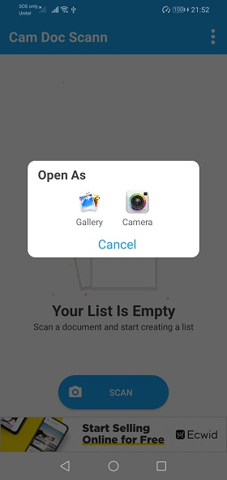
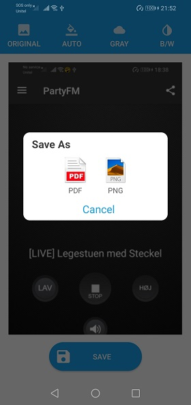
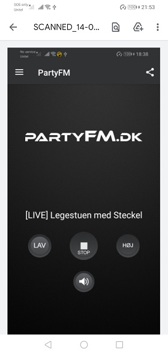
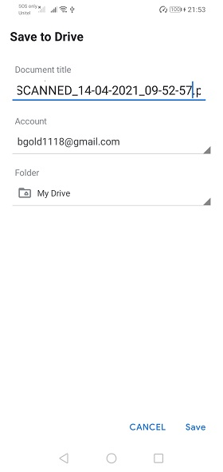

# CamDocScann-Android

This is an android Document Scanning project written in kotlin.
This app automatically detect the edge of the paper over a contrasting surface.After the page is detected, it compensates any perspective from the image adjusting it to a 90 degree top view and saves it on a folder on the device.

## Features

Scan handwritten or printed documents
Detects page frame and corrects perspective automatically
Fast and smooth Image Processing on the fly
Scans are saved to your device as images or pdf
Advance image processing to enhance images for greyscale and contrast

## Get Started
 Please create firebase project and add anroid project with your package name. Download google-services.json and move it to app folder.
 You can change the package name in the project and build and run the project.

## Screenshot

|                Screenshot               |                 Screenshot            |               Screenshot              |
|:---------------------------------------:|:-------------------------------------:|:-------------------------------------:|
|    |      |    |

|                Screenshot               |                 Screenshot            |               Screenshot              |
|:---------------------------------------:|:-------------------------------------:|:-------------------------------------:|
|    |      |    |

|                Screenshot               | 
|:---------------------------------------:|
|    |  
